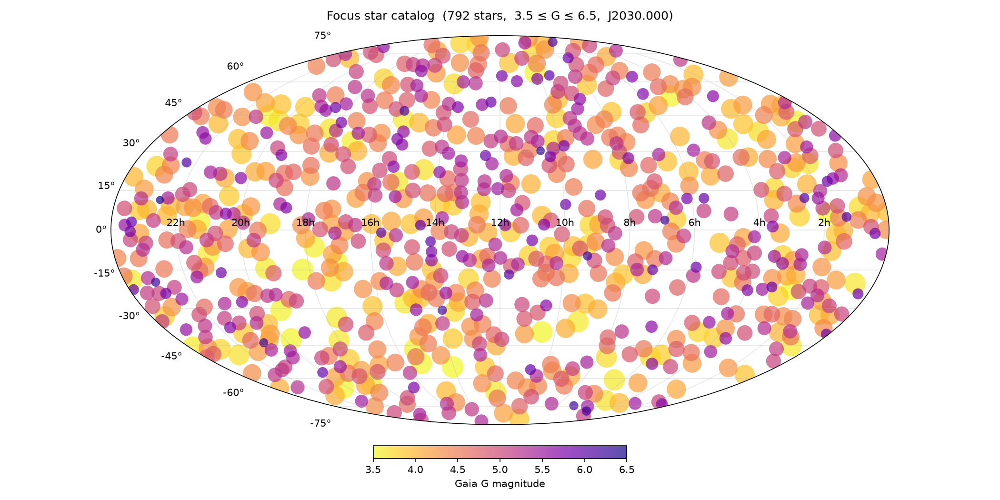

# Focus Star Catalog

A catalog of ~2,500 isolated bright stars suitable for telescope focusing, generated from Gaia DR3. Designed for use with TheSkyX as a user-added catalog.



## Catalog properties

- **Magnitude range**: 3.5 ≤ G ≤ 6.5
- **Field isolation**: brightest star within 2° — no brighter star will accidentally be selected instead
- **Focus-box isolation**: no other Gaia source (to G < 8.5) within 5 arcmin — clean PSF for HFD/centroid algorithms
- **Non-variable**: Gaia `phot_variable_flag != VARIABLE`
- **Stellar sources only**: `classprob_dsc_combmod_star > 0.5` (or NULL for bright stars not assessed by the pipeline)
- **Coordinates**: ICRS J2000.0, propagated from Gaia DR3 J2016.0 using per-star proper motions
- **Names**: HIP numbers where available (Hipparcos cross-match), Gaia source_id otherwise

## Files

| File | Description |
|------|-------------|
| `make_bright_star_catalog.py` | Script to regenerate the catalog from Gaia DR3 |
| `bright_star_catalog.txt` | Catalog in TheSkyX fixed-width text format |
| `bright_star_catalog.SDBX` | Pre-built TheSkyX user catalog database |
| `bright_star_catalog.png` | Mollweide all-sky plot of catalog stars |
| `AtFocus2.dbq` | AtFocus2 database file |

## Regenerating the catalog

Requires [uv](https://docs.astral.sh/uv/). Dependencies are managed automatically via PEP 723 inline metadata.

```bash
uv run make_bright_star_catalog.py
```

This will query the Gaia DR3 archive (~30–60 seconds for the async job), apply the isolation filters, and write a fresh `bright_star_catalog.txt` and `bright_star_catalog.png`.

## Importing into TheSkyX

1. **Back up the original database query file** before making any changes:
   ```
   ~/Library/Application Support/Software Bisque/TheSkyX Professional Edition/Database Queries/AtFocus2.dbq
   ```

2. Copy `AtFocus2.dbq` to:
   ```
   ~/Library/Application Support/Software Bisque/TheSkyX Professional Edition/Database Queries/
   ```

3. Copy `bright_star_catalog.SDBX` to:
   ```
   ~/Library/Application Support/Software Bisque/TheSkyX Professional Edition/SDBs/
   ```

Stars will then appear in TheSkyX with an `AF2` prefix. When searching, include the prefix — for example:

| Star | Search for |
|------|-----------|
| HIP 36046 | `AF2 HIP 36046` |
| Gaia source 3314024566919613952 | `AF2 GAI 3314024566919613952` |

## Customising the catalog

The key parameters are on lines 47–52 of `make_bright_star_catalog.py`:

```python
OUTPUT_FILE = "bright_star_catalog.txt"
MAG_DOWNLOAD = 8.5    # download limit (2 mag deeper for proximity checks)
MAG_UPPER    = 6.5    # output upper limit
MAG_LOWER    = 3.5    # output lower limit
FIELD_DEG    = 2.0    # field-isolation radius (degrees)
BOX_ARCMIN   = 5.0    # focus-box isolation radius (arcmin)
```

After adjusting these and running the script, a new `bright_star_catalog.txt` will be produced. To use it in TheSkyX you will need to reimport the text file to generate a new `.SDBX` database file, then copy that into the `SDBs` folder as described above.

## Filter logic

The script applies filters in a specific order to ensure bright stars outside the final magnitude range still act as contaminants:

1. Download all Gaia sources with G < 8.5 (no type filtering at this stage)
2. Remove any source that has a brighter source within 2° (field isolation)
3. Remove any surviving candidate that has any other source within 5 arcmin (focus-box isolation, checked against the full G < 8.5 download)
4. Keep only stellar, non-variable sources with 3.5 ≤ G ≤ 6.5
5. Propagate positions from Gaia J2016.0 to J2000.0 using proper motions
